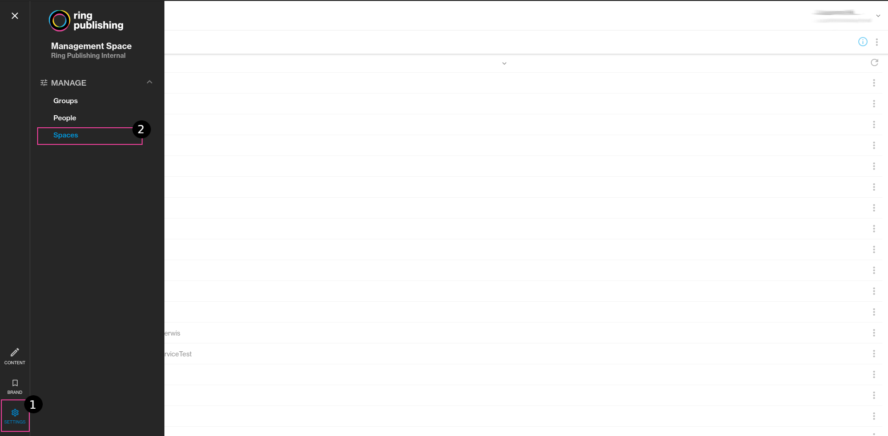

### **Who can configure Stories module**

Story customization can be performed only by authorized persons, most commonly people assigned to the _Portal Administrators_ group.

test test

### **How to configure**

**Step 1** - Open main menu (black square in top left corner) and select **Settings** (bottom left corner) [(1)](https://help.ringpublishing.com/docs/Stories/topics/settings/stories-configuration.html#menu).

This will show manage options, select **Spaces** [(2)](https://help.ringpublishing.com/docs/Stories/topics/settings/stories-configuration.html#menu) to manage configuration of your space.

